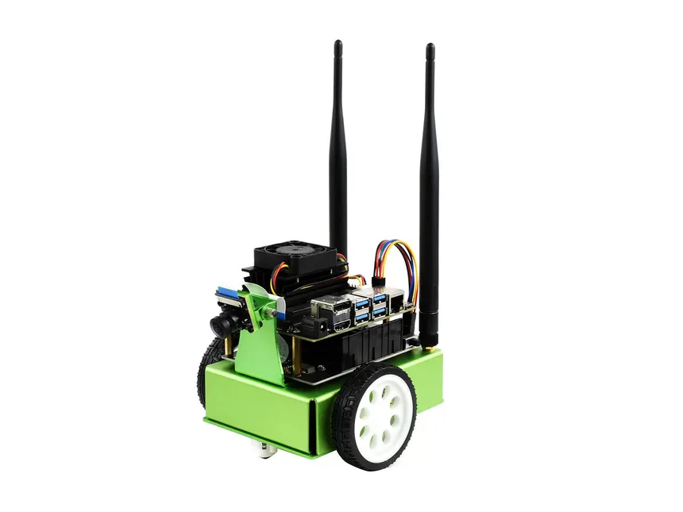

# Autonomes Fahren

Dieses Repo enthält den Code für [JetBot](https://jetbot.org/master/software_setup/sd_card.html).

## Setup

[Dieses Image runterladen und auf eine mindestens 64Gb Sd Karte flashen](https://nvidia.box.com/shared/static/mhtefkijy2c267rbuux6mhelj7ynjohz.zip)

Als nächtes den Jetson booten und via `nmtui` eine WLAN verbindung herstellen.

## No Jupyter
